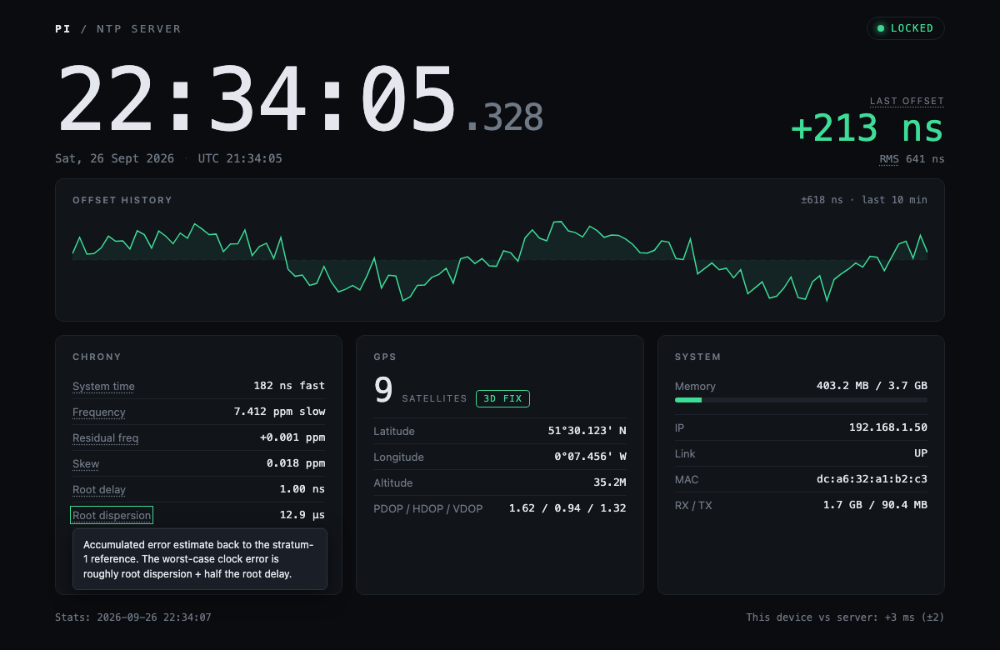

# Pi NTP Display

A GPS-disciplined Raspberry Pi NTP server with a 20x4 LCD clock/stats display and a live web status page.



## Overview

This is a rebuild of my GPS disciplined Raspberry Pi NTP server, using DietPi as a lightweight minimal OS ideally suited for a Pi 1 Model B.

The Pi uses a USB GPS dongle, modified to extract the PPS signal (fed into the Pi on GPIO18) and ultimately fed to gpsd/chrony for high accuracy.

To make it more useful I added a 20x4 LCD display to use it as a clock and show some stats on rotation. The display shows the time + date between each stats page, cycling through two pages of network stats, memory usage, two pages of GPS stats from `gpspipe`, and five pages of chrony stats from `chronyc`. The same stats are also served as a web page.

LCD code is based on a simplified version of [Matt Hawkins' 20x4 LCD code](https://www.raspberrypi-spy.co.uk/2012/08/20x4-lcd-module-control-using-python/); I've just removed the backlight toggling.

## Hardware

- Raspberry Pi (tested on a Pi 1 Model B)
- USB GPS receiver with its PPS output wired to GPIO18
- Displaytech 204A 20x4 character LCD (HD44780-compatible), driven in 4-bit mode

The full LCD pin-to-GPIO wiring table is in the header comment of [Pi_NTP_Display.py](Pi_NTP_Display.py).

## Requirements

- `gpsd` and `gpsd-clients` (provides `gpspipe`), configured for your GPS receiver
- `chrony`, configured to use gpsd/PPS as its reference
- Python 3 with `RPi.GPIO` and `pynmea2`:

  ```bash
  pip3 install RPi.GPIO pynmea2
  ```

The web server uses only the Python standard library.

## Running

```bash
sudo python3 Pi_NTP_Display.py
```

The LCD starts cycling through its pages and the web page is available at `http://<pi-ip>:8080/`.

## Web status page

The page is a single self-contained HTML file served by the script, with no external fonts, scripts or CDNs, so it works on a network with no internet access.

- **Live clock** to the millisecond, running on the Pi's time rather than the viewing device's.
- **Sync status**: LOCKED (chrony synced, 3D GPS fix, offset under 1 ms), DEGRADED (synced but no 3D fix or offset over 1 ms), NO SYNC (chrony not synchronised) or LINK LOST (the page can't reach the Pi).
- **Last offset and RMS offset**, auto-scaled to ns / µs / ms.
- **Offset history chart** of the last 150 chrony samples, kept on the Pi so it survives a page refresh.
- **Chrony, GPS and System panels**. Hover (or tap on a phone) any chrony label for a plain-English explanation of what it means.
- **Device vs server** in the footer: how far the clock of the device you're viewing from is from the Pi.

The page polls every 2 seconds and updates in place without reloading. Note that stats are only re-read from `chronyc`/`gpspipe` as the LCD cycles through the relevant pages, so the history chart gains a few points per LCD cycle.

### JSON API

`GET /api/stats` returns the current stats as JSON, handy for scripts or other dashboards:

```json
{
  "last_updated": "2026-09-26 14:02:11",
  "memory":  { "total": "...", "used": "...", "free": "..." },
  "network": { "ip": "...", "state": "...", "mac": "...", "rx": "...", "tx": "...", ... },
  "gps":     { "fix": "3D Fix", "satellites": "09", "latitude": "...", ... },
  "chrony":  { "last_offset": "+0.000000213 s", "rms_offset": "...", "leap_status": "Normal", ... },
  "offset_history": [[1790000000000, 2.13e-07], ...],
  "server_time_ms": 1790000000123
}
```

Values are passed through as reported by the underlying tools (memory in KiB, network counters in bytes). `offset_history` entries are `[epoch milliseconds, offset in seconds]`.

See [WALKTHROUGH.md](WALKTHROUGH.md) for how the code is structured.

## Changelog

**v1.3**
- Redesigned web page as a live "instrument panel" that updates in place instead of reloading every 5 seconds.
- Added `/api/stats` JSON endpoint, offset history chart, sync status indicator and millisecond clock.
- Web page now shows all chrony fields plus GPS dilution of precision, with explanatory tooltips on the chrony stats.
- Leap status now shows the full text (e.g. "Not synchronised"), and a scheduled leap second is no longer treated as loss of sync.

**v1.2**
- Added live time and date display to the web page.

**v1.1**
- Added web page for display of stats.

**v1.0**
- Initial rebuild on DietPi with LCD clock and rotating stats.

I'm sure there are more efficient ways of doing this, but overall I'm pleased with the result.
